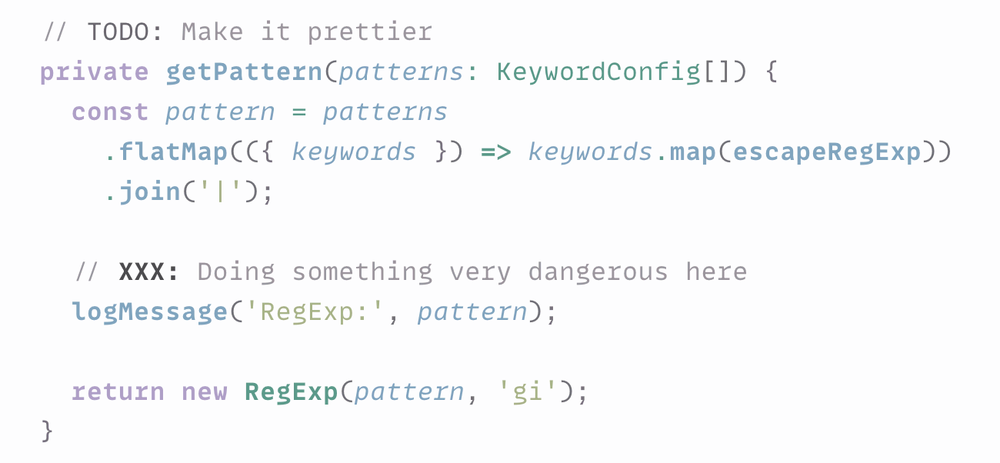
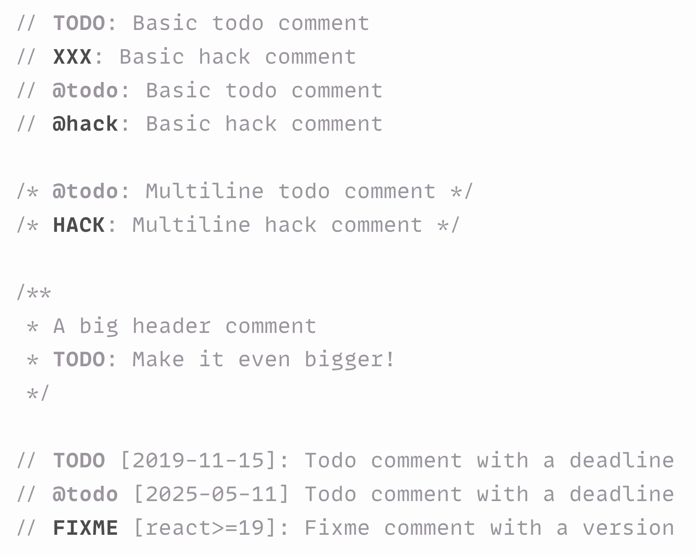

# Todo Tomorrow Visual Studio Code extension ✅

Visual Studio Code extension for highlighting `TODO`, `HACK`, `FIXME`, etc. comments.

**[Install from Visual Studio Marketplace](https://marketplace.visualstudio.com/items?itemName=sapegin.todo-tomorrow)**



## Features

- Very minimal and fast
- Useful defaults to cover most use cases
- Supports JavaScript, TypeScript, Markdown, HTML, CSS, and any other language with C-style comments (`//` or `/* */`)
- Supports light and dark modes out of the box

## Settings

By default the extension highlights all popular types of comments (`TODO`, `FIXME`, `@todo`, etc. — see the whole list below).



You can override the these keywords and their styles.

You can change the following options in the [Visual Studio Code setting](https://code.visualstudio.com/docs/getstarted/settings):

| Description | Setting | Default |
| --- | --- | --- |
| Groups of patterns to highlight | `todoTomorrow.patterns` | See below |

All keywords are case insensitive. See [all supported decoration options](https://code.visualstudio.com/api/references/vscode-api#DecorationRenderOptions).

Here’s how a config file would look like with default options:

```json
{
  "todoTomorrow.patterns": [
    {
      "keywords": ["todo", "@todo"],
      "fontWeight": "bold"
    },
    {
      "keywords": [
        "fixme",
        "fix",
        "xxx",
        "bug",
        "ugly",
        "debug",
        "hack",
        "@fixme",
        "@fix",
        "@xxx",
        "@bug",
        "@ugly",
        "@debug",
        "@hack"
      ],
      "fontWeight": "bold",
      "light": {
        "color": "#4c4b4e"
      },
      "dark": {
        "color": "#dcd5c0"
      }
    }
  ]
}
```

## Changelog

The changelog can be found on the [Changelog.md](./Changelog.md) file.

## You may also like

Check out my other Visual Studio Code extensions:

- [Emoji Console Log](https://marketplace.visualstudio.com/items?itemName=sapegin.emoji-console-log): insert `console.log()` statements with a random emoji
- [Squirrelsong Light Theme](https://marketplace.visualstudio.com/items?itemName=sapegin.Theme-SquirrelsongLight): low contrast non-distracting light theme for web developers
- [Squirrelsong Dark Theme](https://marketplace.visualstudio.com/items?itemName=sapegin.Theme-SquirrelsongDark): low contrast non-distracting dark theme for web developers

## Sponsoring

This software has been developed with lots of coffee, buy me one more cup to keep it going.

<a href="https://www.buymeacoffee.com/sapegin" target="_blank"></a>

## Contributing

Bug fixes are welcome, but not new features. Please take a moment to review the [contributing guidelines](Contributing.md).

## Authors and license

[Artem Sapegin](https://sapegin.me), and [contributors](https://github.com/sapegin/emoji-console-log/graphs/contributors).

MIT License, see the included [License.md](License.md) file.
