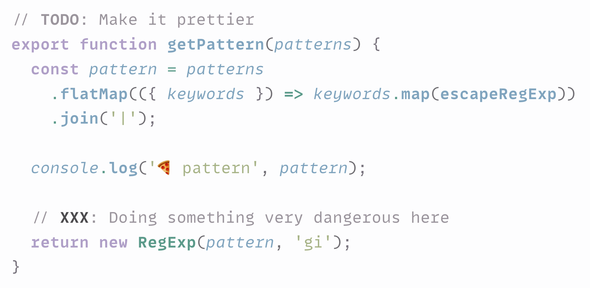
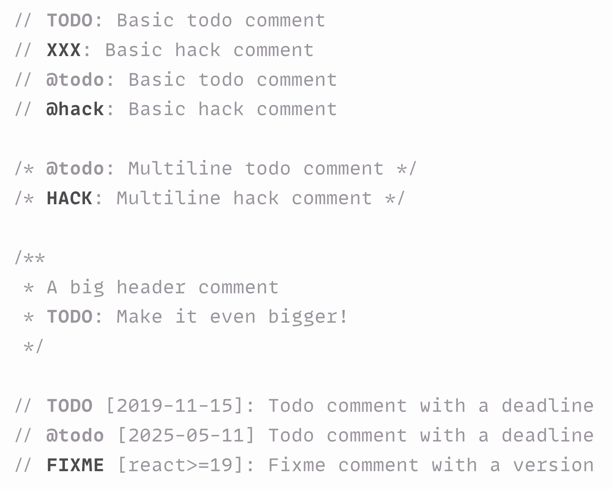

# Todo Tomorrow Visual Studio Code extension ✅

Visual Studio Code extension for highlighting `TODO`, `HACK`, `FIXME`, etc. comments.

**[Install from Visual Studio Marketplace](https://marketplace.visualstudio.com/items?itemName=sapegin.todo-tomorrow)**

[](https://sapegin.me/book/)



## Features

- Very minimal and fast.
- Useful defaults to cover most use cases.
- Supports Bash, CSS, Elixir, Erlang, HTML, JavaScript, LaTeX, Lua, Markdown, Perl, PHP, Python, R, Ruby, SQL, TypeScript, and any other language with C-style comments (`//` or `/* */`).
- Doesn’t add distracting highlights to the scrollbar.
- Supports light and dark modes out of the box, and doesn’t come with insanely bright colors by default.

## Settings

By default the extension highlights the [most popular comment tags](<https://en.m.wikipedia.org/wiki/Comment_(computer_programming)>):

- **Warning comments,** bold and darker color: `BODGE:`, `BUG:`, `HACK:`, `KLUDGE:`, `UGLY:`, `XXX:`, `@bodge`, `@bug`, `@hack`, `@kludge`, `@ugly`, and `@xxx`.
- **Informational comments,** just bold: `DEBUG:`, `FIX:`, `FIXME:`, `NOTE:`, `TODO:`, `UNDONE:`, `@debug`, `@fix`, `@fixme`, `@note`, `@todo`, and `@undone`.



You can override the these keywords and their styles.

You can change the following options in the [Visual Studio Code setting](https://code.visualstudio.com/docs/getstarted/settings):

| Description | Setting | Default |
| --- | --- | --- |
| Groups of patterns to highlight | `todoTomorrow.patterns` | See below |

Matches are case-sensitive, and only two forms of each keyword are matched: `@pizza` or `PIZZA`. However, the case of keywords in the config file is ignored.

See [all supported decoration options](https://code.visualstudio.com/api/references/vscode-api#DecorationRenderOptions).

Here’s how a config file would look like with default options:

```json
{
  "todoTomorrow.patterns": [
    {
      "keywords": ["debug", "fixme", "fix", "note", "todo", "undone"],
      "fontWeight": "bold"
    },
    {
      "keywords": ["bodge", "bug", "hack", "kludge", "ugly", "xxx"],
      "fontWeight": "bold",
      "light": {
        "color": "#4c4b4e"
      },
      "dark": {
        "color": "#dcd5c0"
      }
    }
  ]
}
```

## Motivation

Most existing extensions for highlighting `TODO` and `FIXME` comments. (for example, [this](https://marketplace.visualstudio.com/items?itemName=wayou.vscode-todo-highlight) or [this](https://marketplace.visualstudio.com/items?itemName=aaron-bond.better-comments)) have very bright colors by default; they also show the comments on the scrollbar. This makes them very distracting. `TODO` and `FIXME` comments don’t need to be resolved immediately, and in many cases, they can stay in the codebase for a long time. They are more like tips and warnings for the code reader. I usually write lots of `TODO` comments when I write code, and I don’t want them to distract me — most I will resolve before sending code to review.

The same way we highlight important information in text using bold and italic, we can highlight comments using bold for `TODO` comments (I consider them _informational_) and bold with slightly darker text color for `HACK` and `FIXME` comments (I consider them _warnings_). There’s no need to make them scream at you with an obnoxiously bright pink background.

That’s exactly what Todo Tomorrow does out of the box.

## Changelog

The changelog can be found on the [Changelog.md](./Changelog.md) file.

## You may also like

Check out my other Visual Studio Code extensions:

- [Just Blame](https://marketplace.visualstudio.com/items?itemName=sapegin.just-blame): Git Blame annotations, inspired by JetBrains editors
- [Emoji Console Log](https://marketplace.visualstudio.com/items?itemName=sapegin.emoji-console-log): insert `console.log()` statements with a random emoji
- [Mini Markdown](https://marketplace.visualstudio.com/items?itemName=sapegin.mini-markdown): minimalist kit for comfortable Markdown writing
- [New File Now](https://marketplace.visualstudio.com/items?itemName=sapegin.new-file-now): create new files from the command palette
- [Notebox](https://marketplace.visualstudio.com/items?itemName=sapegin.notebox): take quick notes in the bottom panel
- [Squirrelsong Light Theme](https://marketplace.visualstudio.com/items?itemName=sapegin.Theme-SquirrelsongLight): low contrast non-distracting light theme for web developers
- [Squirrelsong Dark Theme](https://marketplace.visualstudio.com/items?itemName=sapegin.Theme-SquirrelsongDark): low contrast non-distracting dark theme for web developers

## Sponsoring

This software has been developed with lots of coffee, buy me one more cup to keep it going.

<a href="https://www.buymeacoffee.com/sapegin" target="_blank"></a>

## Contributing

Bug fixes are welcome, but not new features. Please take a moment to review the [contributing guidelines](Contributing.md).

## Authors and license

[Artem Sapegin](https://sapegin.me), and [contributors](https://github.com/sapegin/vscode-todo-tomorrow/graphs/contributors).

MIT License, see the included [License.md](License.md) file.
